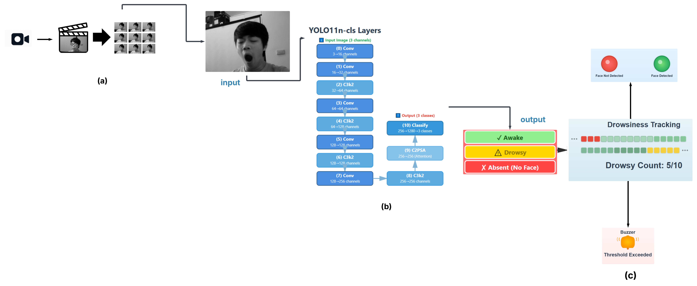
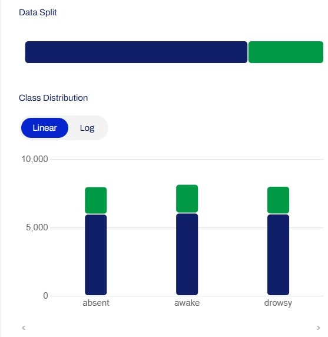
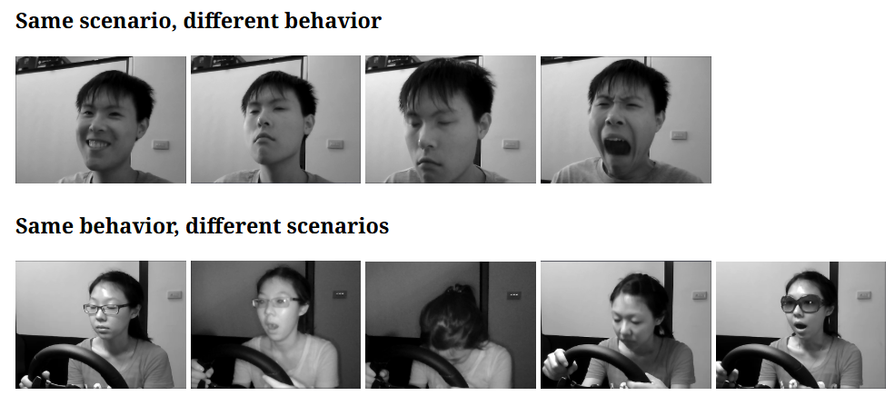
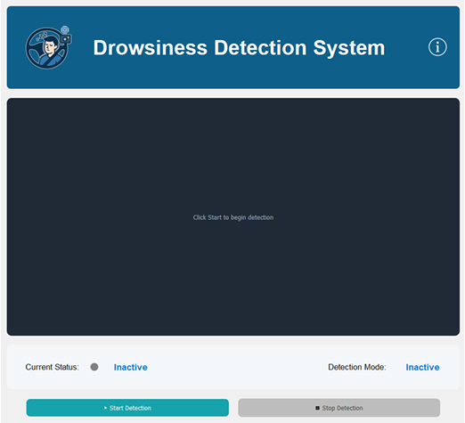
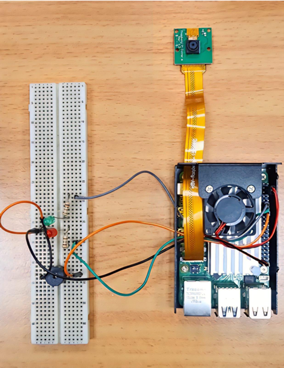

# DriveSafe: AI-Based Driver Drowsiness Detection System

[](https://www.python.org/)
[](https://www.raspberrypi.com/)
[](https://opencv.org/)
[](https://github.com/ultralytics)
[](https://github.com/Tencent/ncnn)

## 📋 Overview

Real-time driver drowsiness detection system using YOLOv11 to monitor facial features and alert drivers before fatigue becomes dangerous. Designed for embedded deployment on Raspberry Pi 5.

**Graduation Project** - Palestine Technical University - Kadoorie  
**Team:** Aseel Jayousi, Hanan Abuzainab 

---

## 🎯 Key Features

- **Real-time Detection**: Monitors driver state at 10 FPS
- **Three-Class Classification**: Awake, Drowsy, Absent
- **Multi-Level Alerts**: Visual (LED) + Audio (Buzzer)
- **Low-Cost Hardware**: Total cost ~$200
- **High Accuracy**: 99.06% on test set
- **Embedded Ready**: Optimized for Raspberry Pi 5

---

## 🏗️ System Architecture



---

## 📊 Dataset

**Total Images:** 24,246  
**Training:** 18,093 | **Testing:** 6,153

| Class | Training | Testing | Total |
|-------|----------|---------|-------|
| Awake | 6,082 | 2,106 | 8,188 |
| Drowsy | 6,011 | 2,034 | 8,045 |
| Absent | 6,000 | 2,013 | 8,013 | 



**Sources:** NTHU-DDD, YawDD, CEW, Kaggle datasets... + custom captures<BR>
* Samples from **NTHU-DDD** :



---

## 🚀 Quick Start

## 🔬 Model Training

- **Framework:** YOLOv11n-cls
- **Platform:** Google Colab Pro (NVIDIA A100)
- **Epochs:** 100
- **Batch Size:** 32
- **Image Size:** 640×640 (training), 224×224 (inference)
- **Augmentation:** Auto (RandAugment)

---

### Desktop Application (Testing Version)

A desktop application was developed for initial testing and validation before hardware deployment.

**Built with:**
- **PyQt5**: GUI framework
- **OpenCV**: Video capture and processing
- **Pygame**: Audio alert system
- **Ultralytics**: YOLOv11 model inference

```bash
# Install dependencies
pip install ultralytics opencv-python PyQt5 pygame

# Run application
python drowsiness_app.py
```

Or download the standalone `.exe` from releases (converted using PyInstaller).

**Features:**
- Real-time video feed with webcam
- Visual status indicators (LED simulation)
- Audio alerts for drowsiness
- Start/Stop controls
- System info dialog



### Raspberry Pi Deployment (Final System)

```bash
# System update and upgrade
sudo apt update && sudo apt upgrade -y

# Install required system packages
sudo apt install -y wget git

# Install Conda
wget https://repo.anaconda.com/miniconda/Miniconda3-latest-Linux-aarch64.sh
bash Miniconda3-latest-Linux-aarch64.sh

# Create environment and install dependencies
conda create -n ultralytics_env python=3.13
conda activate ultralytics_env
pip install ultralytics opencv-python picamera2

# Export model to NCNN format
yolo export model=best.pt format=ncnn

# Run system
python inference_code.py
```

---

## 🔧 Hardware Components

| Component | Purpose |
|-----------|---------|
| Raspberry Pi 5 | Main processor |
| CSI Camera | Video capture |
| Green LED | Face Detected indicator |
| Red LED | Absent indicator |
| Buzzer | Drowsy alert |
| 220Ω Resistors | Current limiting |
| Power Supply | 5V power |

## 📐 Circuit Diagram
| Pi GPIO / Port | Component     | Function                      |
| -------------- | ------------- | ----------------------------- |
| GPIO 17        | Green LED (+) | System Active / Face Detected |
| GPIO 27        | Red LED (+)   | Face Not Detected / Error     |
| GPIO 22        | Buzzer (+)    | Drowsiness Alert              |
| GND            | LEDs & Buzzer | Common Ground (Unified GND)   |
| CSI Port       | Pi Camera     | Video Input                   |
| 5V             | Power Rail    | System Power                  |



---

## 📈 Performance Metrics

| Metric | Value |
|--------|-------|
| Accuracy | 99.06% |
| Precision | 99.06% |
| Recall | 99.07% |
| F1-Score | 99.06% |
| Inference Time (NCNN) | ~94 ms/frame |


---

## ⚡ Optimizations

1. **NCNN Export**: 4× faster inference vs PyTorch
2. **Resolution Reduction**: 640→224 for embedded deployment
3. **Frame Rate Control**: 10 FPS to match processing speed
4. **Temporal Smoothing**: 10-frame window for alert threshold (1 second)

---

## 🎓 Academic Context

This system was developed as a graduation project for Bachelor's degree in Computer Systems Engineering at Palestine Technical University - Kadoorie (January 2026).

**Citation:**
```
Jayousi, A., Abuzainab, H. (2026). DriveSafe: AI-Based Driver Drowsiness Detection System.
Palestine Technical University - Kadoorie.
```

---


## 👥 Authors

- **Aseel Jayousi**
- **Hanan Abuzainab**

---

## 🙏 Acknowledgments

- Palestine Technical University - Kadoorie
- NTHU Computer Vision Lab (NTHU-DDD dataset)

---

**Drive Safe • Stay Alert • Save Lives** 🚗💚
